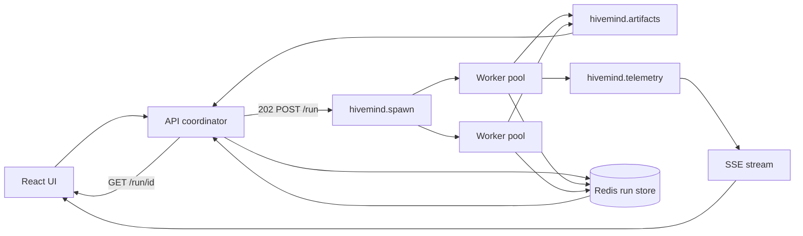

# HiveMind architecture decisions

Record of major design choices for the Kafka event bus (Phase 0–2). Short justifications for later review.

## Current state (Phase 0–1b, shipped on `feature/kafka-bus`)

LangGraph runs the full agent graph in-process. Kafka is a **sidecar**: nodes publish spawn configs, artifacts, telemetry, and run lifecycle events, but **nothing consumes `hivemind.spawn` to execute work**. SSE reads `hivemind.telemetry` only. `POST /run` blocks until `graph.ainvoke()` completes.

Phase 1b added `bus_summary` counters at publish time to bridge Kafka event counts and `data/*.json` tier metrics.

**Merge policy:** No PR to `main` until bus-native execution is complete (Phase 2) and the owner explicitly approves.

---

## Event bus

| Decision | Choice | Justification |
|----------|--------|---------------|
| Broker | Redpanda (Kafka API) | Single container, Kafka-compatible, low local ops overhead |
| Client library | `aiokafka` | Matches async FastAPI; non-blocking producer lifecycle |
| Partition key | `run_id` | Per-run ordering; all artifacts for one investigation co-locate |
| Per-agent ordering | `sequence` in envelope | Monotonic per `(run_id, agent_id)` without composite Kafka keys |
| Serialization | JSON UTF-8 (v1) | Simple debugging with `rpk topic consume`; Schema Registry deferred to Phase 3 |
| Bus optional | No-op when `KAFKA_BOOTSTRAP` unset | Local dev without Docker; tests without broker |
| Client `/run` timeout | 10 minutes (Phase 1) | Full agent graph commonly takes 2–3+ minutes; removed by Phase 2c async API |
| Kafka publish thread | Dedicated worker loop | Sync graph nodes were blocking on FastAPI loop → 30s publish timeouts |
| Publish context in workers | `bind_from_state()` per node | `ContextVar` does not propagate to LangGraph thread-pool workers; `run_id` is on state / fan-out payloads |
| Evidence on bus | Not in Phase 1–2 | Dataset rows stay API/compiler-only; avoids LLM row leakage on the bus |

## Topics

| Topic | Purpose (Phase 1) | Purpose (Phase 2+) |
|-------|-------------------|---------------------|
| `hivemind.runs` | `run_started`, `run_completed`, `run_failed` | Same; coordinator publishes lifecycle |
| `hivemind.spawn` | Informational `agent_config`, `child_config` mirrors | **Executable work commands** consumed by workers |
| `hivemind.artifacts` | memos, rankings, causal payloads, estimate reports | Worker outputs; coordinator reads for phase advance |
| `hivemind.telemetry` | UI `ExecutionEvent`-compatible phase events | Unchanged; SSE source |
| `hivemind.evidence` | Reserved; API-only | Reserved until Phase 3 |

## API and UI

| Decision | Choice | Phase |
|----------|--------|-------|
| `/run` semantics | **202 Accepted** + `GET /run/{run_id}` for artifact | Phase 2c (default) |
| `/run/sync` | Blocking 200 JSON | Scripts and integration tests |
| `run_id` | Client-supplied (optional) | Enables SSE subscription before POST |
| SSE route | `GET /run/{run_id}/events` | Maps telemetry envelopes to `ExecutionEvent` |
| SSE offset | `auto_offset_reset=latest` | Client connects before POST; in-flight run events only |
| LangGraph state | Full memos in `GraphState` | Phase 1 only; replaced by run store in Phase 2 |
| UI phases | Graph-aligned (`ORCHESTRATOR`, …) | Unchanged across phases |
| UI completion | POST response body = artifact | Phase 1; Phase 2c: SSE terminal + GET artifact |

## Delivery

| Decision | Choice | Justification |
|----------|--------|---------------|
| Branch policy | `feature/kafka-bus` → single merge to `main` | No partial merges until bus-native execution works end-to-end |
| `data/*.json` | Written at run end | User-facing bundle; Kafka is event log not query API |
| `data/runs.db` | SQLite run store (Phase 2a) | Durable coordinator state without new compose services |

## Phase 1b (bus summaries)

| Decision | Choice | Justification |
|----------|--------|---------------|
| GraphState slimming | Deferred to Phase 2 | Evaluator/causal still need full memos in-process until coordinator + store |
| `bus_summary` | Counters on publish context | Bridges Kafka event log and `data/*.json` tier metrics without consuming topics |
| Benchmarking | Counts from summary + sample memo | Orchestrator/parent/child/evaluator tiers use bus counts; causal/estimator unchanged |

`bus_summary` fields: `parent_config_count`, `child_config_count`, `memo_count`, `has_ranked_strategies`, `has_causal_payload`, `has_estimate_report`.

---

## Phase 2 — Bus-native execution (no sidecar)

**Goal:** Remove the sidecar. The coordinator schedules work; **`hivemind.spawn` commands trigger agent execution**; a durable run store replaces LangGraph memory and barriers. LangGraph `Send` fan-out and `graph.ainvoke()` are removed from the execution path.

### Locked-in choices

| Decision | Choice | Justification |
|----------|--------|---------------|
| Worker deployment | **In-process consumers first**, separate container in 2d | Fastest path to bus-native logic; same compose stack; `WorkerExecutor` interface designed for split |
| API rollout | **Two-step:** blocking `POST /run` during 2a–2b, then **202 + GET** in 2c | Prove coordinator/barriers with curl/smoke tests before frontend and HTTP contract change |
| Run state store | SQLite `data/runs.db` | Zero new infra; sufficient for single-process coordinator and in-process workers |
| Scheduler | Hand-rolled coordinator state machine | Mirrors current DAG: orchestrator → parents → barrier → children → evaluate → causal → estimate → refutation loop |
| Node functions | Reuse LLM logic from `agents.py`, `evaluator.py`, `causal.py` | Strip LangGraph scheduling; workers call `(command) -> result` |
| Spawn protocol | Extend envelopes with executable commands + `task_id` + `idempotency_key` | At-least-once Kafka delivery safe in 2d |

### Sub-phases

| Sub-phase | Delivers | Sidecar gone? | UI change? | Status |
|-----------|----------|---------------|------------|--------|
| **2a** Coordinator + run store; replace `graph.ainvoke` | State machine + SQLite; blocking `/run` | Partial (scheduler only) | No | Done |
| **2b** Spawn-driven fan-out | In-process consumers on `hivemind.spawn`; remove LangGraph `Send` | Yes (fan-out) | No | Done — `src/worker/` |
| **2c** Async API + frontend | `POST /run` → 202; `GET /run/{run_id}`; SSE terminal + fetch | Yes (full user contract) | Yes | Done |
| **2d** Pre-PR hardening | Idempotency, DLQ, optional separate `worker` container, docs, smoke | Production-ready | Minimal | Planned |

**Phase 2 done** = 2c + 2d acceptance. Only then consider PR to `main`.

### New components (Phase 2)

- **`src/coordinator/`** — run state machine, barriers, refutation loop, artifact assembly (replaces `graph.py` scheduling).
- **`src/coordinator/store.py`** — `RunStore` over SQLite: task, evidence, phase, configs, memos, causal outputs, counters.
- **`src/worker/`** — Kafka consumer on `hivemind.spawn`, dispatch to node functions, publish artifacts + `task_completed`.
- **`GET /run/{run_id}`** — run status (`queued` \| `running` \| `completed` \| `failed`) and artifact when complete.

### What Phase 2 explicitly does not include

- Multi-region or horizontally scaled worker pools (Phase 3)
- Redis/shared store for multi-container coordination (Phase 3; SQLite stays for local dev)
- `hivemind.evidence` topic, Avro/Schema Registry, S3/MinIO (Phase 3)
- 5D spatiotemporal graph engine (README roadmap; separate initiative)

---

## Phase 3 — Full distributed architecture

**Goal:** Production-grade distributed execution: workers scale independently, shared run state survives process restarts across services, and the bus carries hardened delivery semantics. Phase 2 proves the coordinator + spawn protocol; Phase 3 operationalizes it.

### Planned scope

| Area | Phase 3 deliverable |
|------|---------------------|
| **Worker fleet** | Dedicated `worker` service(s) in compose/k8s; horizontal scale; coordinator-only API container |
| **Run state store** | Redis (or Postgres) as primary store; SQLite retained for local/offline dev via `RunStore` interface |
| **Delivery guarantees** | Idempotency keys on all spawn commands; retry policy; dead-letter topic for poison messages |
| **Serialization** | Avro + Schema Registry (or equivalent); versioned envelope v2 |
| **Evidence pipeline** | `hivemind.evidence` topic; normalized records on bus for audit/replay (not LLM prompt injection) |
| **Large payloads** | S3/MinIO refs in artifacts; inline Kafka bodies for small messages only |
| **Run recovery** | Coordinator and workers resume in-flight runs after restart from durable store + Kafka offsets |
| **Observability** | Consumer lag metrics, run phase dashboards, DLQ alerting |
| **Benchmarking** | Tier metrics from store replay / topic consumption, not in-process publish counters |

### Architecture (Phase 3 target)

### Phase 2 → Phase 3 migration principle

Phase 2 code is structured so Phase 3 is mostly **deployment and store backend swaps**, not a protocol rewrite:

- `WorkerExecutor` interface: in-process (Phase 2) → remote container (Phase 3)
- `RunStore` interface: SQLite (Phase 2) → Redis (Phase 3)
- Spawn/artifact envelope shapes unchanged where possible
- Same coordinator state machine and barrier rules

---

## Phase summary

| Phase | One-line description |
|-------|---------------------|
| **0–1** | Kafka sidecar: LangGraph executes; bus publishes for telemetry and audit |
| **1b** | `bus_summary` counters; hardening; no execution model change |
| **2** | Bus-native: coordinator + spawn consumers + run store; async API; no LangGraph scheduling |
| **3** | Full distributed: scaled workers, shared store, DLQ/idempotency, evidence topic, payload storage |
