# CausalOps

**An evidence-backed causal reasoning engine for cyber operations.**

CausalOps turns a messy incident prompt into a structured investigation: agents
decompose the problem, write decision memos, propose a causal graph, compile
external evidence into observations, and only then estimate intervention impact
with DoWhy and statsmodels.

The important design choice is simple:

> The LLM proposes hypotheses. Evidence decides whether an ATE is allowed to
> exist.

---

## What Makes This Different

Most agent demos stop at a confident narrative. CausalOps is built to survive the
obvious engineering objection: "Where did the data come from?"

| Layer | What it does | Guardrail |
| --- | --- | --- |
| Orchestrator | Splits an incident into 2-3 investigation tracks | Standardized tier scoring |
| Island evolution | Evolves parent/child policy priors before dispatch | Steady-state replacement, bounded mutation, migration |
| Parent agents | Spawn focused child investigators | Explicit objectives per branch |
| Child agents | Produce decision memos | Assumptions, risks, evidence needs |
| Evaluator | Ranks memos against task priorities | Structured scores and final recommendation |
| Causal architect | Proposes a DAG and measurement plan | No dataset-row generation |
| Evidence compiler | Converts SIEM/CVE/report records into numeric rows | Provenance, missingness, balance gates |
| Estimator | Runs DoWhy, statsmodels, and refuters | ATE withheld when data is weak |
| Policy RL loop | Learns policy shards from the KG/evaluator/reasoner reward | Model-based Q-values and bidirectional meta-learning |

---

## Architecture

```mermaid
flowchart LR
    A["Incident prompt"] --> B["Grand Orchestrator"]
    B --> B1["Parent Island Evolution"]
    B1 --> C["Parent Agents"]
    C --> C1["Child Island Evolution"]
    C1 --> D["Child Agents"]
    D --> E["Evaluator"]
    E --> F["Causal Hypothesis Architect"]
    F --> G["Measurement Plan + DAG"]
    H["SIEM / CVE / Incident Exports"] --> I["Evidence Normalizers"]
    I --> J["Evidence Dataset Compiler"]
    G --> J
    J --> K{"Data gates pass?"}
    K -->|No| L["Withhold ATE"]
    K -->|Yes| M["DoWhy identification + estimation"]
    M --> N["Statsmodels p-value + CI"]
    M --> O["Refuters"]
    N --> Q["Reasoning Layer"]
    O --> Q
    L --> Q
    Q --> R["KG-Grounded RL + Meta-Learning"]
    R --> S["Kafka Policy Artifact"]
    S --> T["5D Knowledge Graph Update"]
    T --> P["Run artifact"]
```



---

## Answering The Hard Questions

### 1. Where does DoWhy data come from?

DoWhy runs on the dataframe produced by `dataset_compiler.py`. That dataframe is
compiled from normalized `EvidenceRecord` objects, not from LLM-generated rows.
Each compiled row keeps source provenance:

- `source_type`: `siem`, `edr`, `cve`, `incident_report`, `asset_inventory`, or
  `manual`
- `source_name`: concrete export/feed/index name
- `raw_ref`: pointer to the original record
- `asset_id` and `observed_at`: row-level traceability

### 2. Is the LLM confirming its own story?

No. The LLM is restricted to graph and measurement-plan generation. Synthetic
records are skipped by the compiler and cannot pass the empirical-data gate.
If real evidence is missing, the estimator returns:

```text
method = withheld:data_quality_gates
ate = null
p_value = null
```

### 3. Is this connected to real data sources?

The API now supports export-based normalization for:

- `POST /normalize/sentinel` for Microsoft Sentinel or SIEM-like rows
- `POST /normalize/cve` for NVD/CVE feed records
- `POST /normalize/incidents` for incident report exports

The current demo does not require live tenant credentials. It accepts exported
records, normalizes them into the shared evidence schema, and sends them through
the same causal compiler used by `/estimate` and `/run`.

### 4. How many rows does DoWhy need, and why 50?

CausalOps treats 50 complete treatment/outcome observations as a minimum smoke
gate, not as a universal statistical guarantee. The estimator also requires at
least 10 treated and 10 control rows, observed variation in treatment/outcome,
and acceptable covariate missingness. The report warns that 200+ rows are
recommended for a more stable estimate.

Below the gate, ATE is withheld. Above the gate, the report still exposes
`n_rows`, treatment/control counts, missingness, warnings, p-value, confidence
interval, and refuter results so reviewers can judge strength.

### 5. Where is the p-value computed?

The p-value is computed in `estimators.py` with `statsmodels.OLS` against the
treatment coefficient, using the same treatment/outcome/adjustment set that
DoWhy estimates. It is not hard-coded.

### 6. Is there a standardized metric for agent tiers?

Yes. `benchmarking.py` emits deterministic tier metrics for:

- orchestrator decomposition
- parent-agent child task quality
- child memo completeness
- evaluator output shape
- causal graph validity
- estimator readiness

The final artifact includes `agent_tier_metrics.overall_score` and per-tier
observed signals.

### 7. What does agent evolution optimize?

`evolution.py` runs a deterministic steady-state island algorithm after the
orchestrator produces parent configs and again after parents produce child
configs. Each island maintains compact policy genomes with traits such as
`evidence_weight`, `causal_focus`, `temporal_awareness`, `exploration`,
`exploitation`, `risk_aversion`, `coordination`, and `resource_budget`.

The algorithm uses tournament selection, crossover, bounded mutation,
steady-state replacement, and periodic migration. It does not rewrite the
incident or fake evidence. It attaches an `AgentPolicy` prior to each
`AgentConfig`/`ChildConfig`, publishes `agent_evolution_report`, and agents
receive that prior as prompt guidance.

### 8. How does the reinforcement-learning loop work?

`policy_learning.py` starts from the 5D spatiotemporal knowledge graph snapshot,
then builds a model-based RL report from:

- evaluator scores over child memos
- causal estimate strength and data gates
- reasoning-layer anomalies and recommendations
- KG topology and edge confidence

It computes global rewards, transition weights from KG edges, value-iteration
Q-values, a greedy policy, and a Stackelberg-style leader/follower response.
Then bidirectional meta-learning pushes a shared prior down into child policy
shards and aggregates local deltas back into an updated meta-prior. The result is
published as `policy_optimization_report`, ingested back into the 5D graph, and
available in the final run artifact.

### 9. How does the LLM know which confounders to suggest for the DAG?

The Causal Architect performs a Semantic Intersection between the incident prompt and the available telemetry schema. It proposes candidate confounders (e.g., Asset_Criticality) which are then validated by the Evidence Normalizer. If the variable exists in the physical logs, it stays; if it's a hallucination, the Gatekeeper prunes the edge before estimation.

---

## Run It

Create a root `.env` file:

```env
GEMINI_API_KEY="..." # Get your API Key here: https://aistudio.google.com/u/1/api-keys
GEMINI_BASE_URL="https://generativelanguage.googleapis.com/v1beta/openai/"
GEMINI_MODEL="gemini-2.5-flash"

# To use the high-reasoning model:
# GEMINI_MODEL="gemini-2.5-pro"
```

With Docker Compose, Kafka is enabled automatically via Redpanda:

```env
# Set only when running the API outside Compose (Compose uses redpanda:9092)
KAFKA_BOOTSTRAP=localhost:19092
```

Topics: `causalops.runs`, `causalops.spawn`, `causalops.artifacts`, `causalops.telemetry`, `causalops.evidence`, `causalops.dlq`.

Compose runs three backend processes: **api** (coordinator + SSE, no spawn consumer), **worker** (spawn consumer), and **redpanda**. Both api and worker share `./data` for the SQLite run store.

| Env var | Default (compose) | Purpose |
|---------|-------------------|---------|
| `CAUSALOPS_ENABLE_SPAWN_WORKER` | `0` on api, `1` on worker | In-process spawn consumer in api when `1` |
| `CAUSALOPS_SPAWN_MAX_RETRIES` | `2` | Dispatch retries before DLQ |
| `CAUSALOPS_SPAWN_RETRY_BACKOFF_MS` | `1000` | Delay between spawn retries |
| `CAUSALOPS_DATA_DIR` | repo-root `data/` | Run artifacts, run store, and 5D graph SQLite files |

For single-process local dev without the worker container, set `CAUSALOPS_ENABLE_SPAWN_WORKER=1` on the api service.

Live UI progress uses SSE. The frontend generates a `run_id`, opens
`GET /run/{run_id}/events`, then calls `POST /run` with the same id. If
`KAFKA_BOOTSTRAP` is unset, the graph still runs but the event stream is empty.

### Verify the event bus

With the stack running (`docker compose up`), run:

```bash
chmod +x scripts/smoke_kafka_bus.sh
./scripts/smoke_kafka_bus.sh
```

Runs bus unit tests, checks `/health`, and lists Redpanda topics when compose is up.

Start the full stack:

```bash
docker-compose up --build
```

Open:

- Frontend: <http://localhost:8080>
- API docs: <http://localhost:8000/docs>
- Health check: <http://localhost:8000/health>

Stop it:

```bash
docker-compose down
```

---

## Fast Demo Without LLM Tokens

Run the deterministic evidence-backed demo:

```bash
curl http://localhost:8000/demo/estimate
```

That endpoint uses a fixed SIEM-style evidence fixture for:

- treatment: `Patch_Applied`
- outcome: `Lateral_Movement`
- confounder: `Asset_Criticality`

It exercises the same compiler, data gates, DoWhy estimator, statsmodels
p-value/CI reporting, and refuters used by real evidence.

---

## Estimate From Your Own Evidence

```bash
curl -X POST http://localhost:8000/estimate \
  -H "Content-Type: application/json" \
  -d '{
    "graph": {
      "nodes": [
        {"id": "Patch_Applied", "label": "Patch Applied", "description": "Asset patched before the observation window"},
        {"id": "Lateral_Movement", "label": "Lateral Movement", "description": "Lateral movement observed after exposure"},
        {"id": "Asset_Criticality", "label": "Asset Criticality", "description": "High-value asset tier"}
      ],
      "edges": [
        {"source": "Asset_Criticality", "target": "Patch_Applied", "relationship": "Critical assets are prioritized"},
        {"source": "Asset_Criticality", "target": "Lateral_Movement", "relationship": "Critical assets attract more movement"},
        {"source": "Patch_Applied", "target": "Lateral_Movement", "relationship": "Patching reduces exploitability"}
      ],
      "treatment_variable": "Patch_Applied",
      "outcome_variable": "Lateral_Movement",
      "candidate_confounders": ["Asset_Criticality"]
    },
    "evidence_records": [
      {
        "source_type": "siem",
        "source_name": "sentinel-kql-export",
        "observed_at": "2026-05-12T10:00:00Z",
        "asset_id": "host-001",
        "raw_ref": "row-001",
        "extracted_fields": {
          "Patch_Applied": 1,
          "Lateral_Movement": 0,
          "Asset_Criticality": 1
        }
      }
    ]
  }'
```

With only one row, this returns an explicit data-quality refusal instead of a
fake causal result. That is the point.

---

## Normalize Real Exports

Normalize Sentinel/SIEM rows:

```bash
curl -X POST http://localhost:8000/normalize/sentinel \
  -H "Content-Type: application/json" \
  -d '{"source_name":"sentinel-prod-kql","records":[{"TimeGenerated":"2026-05-12T10:00:00Z","Computer":"host-001","AlertName":"Lateral movement detected","Patch_Applied":1,"Lateral_Movement":0,"Asset_Criticality":1}]}'
```

Normalize CVE feed records:

```bash
curl -X POST http://localhost:8000/normalize/cve \
  -H "Content-Type: application/json" \
  -d '{"records":[{"id":"CVE-2026-0001","published":"2026-05-01","baseScore":9.1,"descriptions":[{"lang":"en","value":"Example vulnerable service."}]}]}'
```

Normalize incident report rows:

```bash
curl -X POST http://localhost:8000/normalize/incidents \
  -H "Content-Type: application/json" \
  -d '{"records":[{"incident_id":"INC-42","created_at":"2026-05-12","asset_id":"host-001","severity":"high","summary":"Credential misuse followed by lateral movement."}]}'
```

---

## Backend Files

| File | Role |
| --- | --- |
| `api.py` | FastAPI surface: `/run`, `/estimate`, `/demo/estimate`, normalizers |
| `agents.py` | Orchestrator, parent-agent, and child-agent LangGraph nodes |
| `evolution.py` | Steady-state island evolution for parent/child policy priors |
| `evaluator.py` | Adaptive structured evaluator for decision memos |
| `causal.py` | Causal hypothesis generation and estimator node wiring |
| `dataset_compiler.py` | Evidence-to-dataframe compiler and statistical gates |
| `estimators.py` | DoWhy estimation, statsmodels p-values/CIs, refuters |
| `policy_learning.py` | KG-grounded RL loop, Q-values, Stackelberg response, meta-learning |
| `graph_5d.py` / `graph_5d_stream.py` | 5D spatiotemporal KG storage and Kafka artifact ingestion |
| `evidence_adapters.py` | Sentinel/CVE/incident export normalization |
| `benchmarking.py` | Deterministic tier metrics for the agent pipeline |
| `schema.py` | Pydantic and LangGraph state contracts |
| `engine.py` | End-to-end run orchestration and artifact persistence |
| `demo_fixtures.py` | Deterministic evidence-backed smoke-test fixture |
| `main.py` | Legacy Streamlit inspection UI |

---

## Engineering Standards

- Docker-first execution via `docker-compose up --build`
- Installable backend package defined in `pyproject.toml`
- Runtime Python pins in `requirements.txt`; dev tooling in `requirements-dev.txt`
- `.dockerignore` files for smaller, safer build contexts
- Ruff linting is configured in `pyproject.toml` and enforced in CI
- CORS restricted to local demo origins by default
- ATE/p-value withheld when evidence gates fail
- Evolution and policy-learning reports are published as Kafka artifacts
- Run artifacts persisted under `CAUSALOPS_DATA_DIR` (`data/` by default)

---

## Roadmap

- Authenticated Microsoft Sentinel connector
- Splunk HEC/search export connector
- NVD API puller with scheduled CVE refresh
- Larger benchmark suite with golden incident prompts
- Streaming execution telemetry from LangGraph to the React UI
- Backtesting against historical incident retrospectives
- Persistent cross-run policy memory for seeding future island populations

---

## Future Enhancements

- **Production-Grade MCP Intelligence Fabric:** Build a distributed MCP client layer capable of dynamically discovering, authenticating, and routing across agentic topics within the swarm. Agents will interface with specialized cyber-oriented MCP servers providing contextual memory, threat intelligence enrichment, tool orchestration, policy enforcement, and reasoning augmentation. The long-term goal is a zero-trust, latency-aware intelligence plane for autonomous multi-agent coordination.
- **Deep Hierarchical Agent Expansion:** Introduce additional recursive child-agent layers with adaptive spawning policies driven by task complexity, uncertainty, and resource availability. Runtime efficiency will be improved through asynchronous execution pipelines, speculative parallel reasoning, and distributed workload scheduling across heterogeneous compute environments.
- **Full Distributed Execution** Production-grade bus-native architecture with horizontally scaled worker services (compose/k8s), a coordinator-only API container, and shared run state in Redis or Postgres (SQLite retained for local dev). Harden the bus with idempotency keys, retry policy, and dead-letter topics; version envelopes with Avro and Schema Registry. Expand `causalops.evidence`, add S3/MinIO refs for large artifacts, in-flight run recovery after restarts, and observability (consumer lag, run-phase dashboards, DLQ alerting). Migrate via existing `WorkerExecutor` (in-process → remote) and `RunStore` (SQLite → Redis) interfaces while keeping spawn/artifact shapes and coordinator barrier rules unchanged.
- **Cross-Run Evolution Memory:** Persist the best policy priors across completed runs so future island populations can start from learned historical priors instead of only run-local seeds.
- **Online RL With Live Kafka Feedback:** Extend the current run-level policy-learning pass into a continuously running controller that updates Q-values as new KG events arrive.
- **Federated Multi-Swarm Coordination:** Extend the architecture toward federated swarm interoperability, where independent agent clusters can exchange semantic state, negotiate objectives, and collaboratively solve large-scale problems while preserving localized autonomy and fault isolation.
- **Adaptive Trust, Reputation, and Reliability Layer:** Implement a reputation-driven trust framework inspired by distributed systems and service mesh architectures. Agents, tools, and MCP servers will be continuously evaluated using latency, correctness, consistency, and semantic reliability metrics, enabling dynamic routing, circuit-breaking, and failure containment across the orchestration graph.
- **Real-Time Causal Reasoning Infrastructure:** Expand the DAG generation pipeline into a streaming causal inference engine capable of constructing and updating probabilistic causal models from live swarm telemetry. This will enable agents to move beyond correlation-based reasoning toward intervention-aware strategic planning and root-cause analysis.
- **Autonomous Resource Governance:** Introduce reinforcement-learning-driven resource allocation for GPU scheduling, agent quotas, memory utilization, and orchestration depth. The system will dynamically balance exploration vs. exploitation while preventing uncontrolled swarm expansion or infrastructure saturation.
- **Persistent Semantic Memory and Retrieval Layer:** Develop a hybrid long-term memory architecture combining vector retrieval, graph traversal, and temporal indexing. Agents will maintain persistent contextual awareness across tasks, enabling longitudinal reasoning, adaptive learning, and higher-order strategic coordination over time.

---

## License

To contribute, contact Darsh Garg at darsh.garg@gmail.com

https://medium.com/@darsh.garg/the-epistemic-crisis-of-ai-agents-and-how-i-built-a-swarm-that-constrains-its-own-uncertainty-22300d8e6c55
